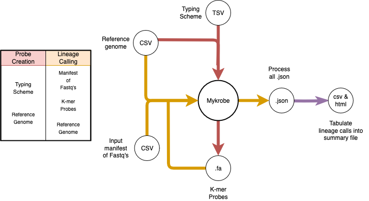

This repo contains scripts that intend to wrap around mykrobe for the lineage calling of treponema strains.
The tool, currently nicknamed trepogeno, can be installed as a system wide package with the below instructions:

To set up functionality you must first: 
1. git clone --recursive https://gitlab.internal.sanger.ac.uk/sanger-pathogens/nextstrain.git
2. cd nextstrain/trepogeno/
3. pip3 install -e . 

Next to ensure mccortex binaries for mykrobe complie correctly

1. cd mykrobe
2. git clone --recursive -b geno_kmer_count https://github.com/Mykrobe-tools/mccortex mccortex
3. cd mccortex
4. make
5. cp bin/mccortex31 ../src/mykrobe/cortex

## Trepogeno.py
This is the main script, once installed system wide as detailed above can be called anywhere with `trepogeno --agrument 1` 

## create_typing_scheme
This subdirectory contains scripts relating to creating a typing scheme through use of Rpinecone, a vcf, and a reference.
These scripts are deprectated and not used in normal execution of the tool.

## Create probes lineage files
To create a probe and lineage file, which is requried for lineage calling, you need a typing scheme and genomic reference.
For more information of creating a typing scheme refer to the typing scheme rule book in the trepogeno directory.

trepogeno \\    
--json_directory files/json_outputs \\  
--type_scheme files/Tpallidum.SNP.table_hierarchies_2025-05-14.tsv \\   
--genomic_reference files/reference/nc_021508.fasta \\  
--probe_and_lineage_dir files/probes \\     
--make_probes \\    
--probe_lineage_name custom_probe_name

## Lineage calling
Required are the lineage and probe files made by mykrobe, a genomic reference, and a manifest containing paths to the reads you want called.

trepogeno \\    
--json_directory files/json_outputs \\  
--genomic_reference files/reference/nc_021508.fasta \\  
--probe_and_lineage_dir files/probes \\     
--seq_manifest /data/nexstrain/manifest.csv \\  
--lineage_call \\   
--probe_lineage_name custom_probe_name

## Process and summarise the mykrobe json outputs
Required is the path to the directory containing the mykrobe output jsons.

trepogeno \\    
--json_directory files/json_outputs \\  
--tabulate_jsons

## Example full run execution

trepogeno \\    
--json_directory files/json_outputs \\
--type_scheme files/Tpallidum.SNP.table.tsv \\  
--genomic_reference files/reference/nc_021508.fasta \\  
--probe_and_lineage_dir files/probes \\ 
--make_probes \\    
--seq_manifest /data/nexstrain/manifest.csv \\  
--probe_lineage_name custom_probes \\   
--tabulate_jsons \\ 
--lineage_call

## All paramaters 

Make Probes
-----------
--make_probes   
    Used to indicate you wish to generate a new set of probes during the work flow

--type_scheme   
    Path to the file that maps snps to specific genomic coordiantes to lineages, to learn more review mykrobe custom lineage calling documentation.

--genomic_reference 
    A fasta file that acts as the genomic reference, must match the reference in the type scheme

--probe_and_lineage_dir 
    This is the directory in which to save the probe and lineage file during probe creation

--probe_lineage_name    
    what to call the custom probe.fa file and lineage.json when writing an output. This changes the prefix, if you supply custom the output will be custom.fa & custom.json. Ommit this flag and it will name them probe.fa and lienage.json.

--kmer_size 
    what kmer size to use when creating the probes. defaults to 21

Lineage Calling
-----------
--lineage_call  
    Used to indicate you wish to execute the lineage calling workflow

--json_directory    
    A path to the directory for mykrobe to save its json files after calling a lineage. These will be named based on the ID supplied in the manifest e.g SRR567232.json

--seq_manifest  
    A manifest of Sample ID and sequences, the heading should be ID,Read1,Read2. If you are not using paired end fastqs and only have one read leave a trailing , e.g. 'ReadID,/fastq/ReadID1.fastq,'

--genomic_reference 
    Provide a path to a fasta file that acts as the genomic reference, must match the reference in the type scheme

--probe_and_lineage_dir 
    This is the directory in which probe.fa and lineage.json file are located

--probe_lineage_name    
    If you wish to use custom probe and lineage files this flag lets you set the name. they must either be the same name prefix e.g custom.fa and custom.json or else ommit this flag and it will instead look for a probe.fa and lineage.json file in the directory you specify. 

--kmer_size 
    what kmer size to use when lineage calling, must match what was used when creating probes, default 21

Json Processing
-----------
--tabulate_jsons    
    Used to indicate you wish to execute the workflow to tabulate the output from mykrobe

--json_directory    
    Supply a path to the directory containing mykrobe summary json's, theses should be in the format mykrobe uses when `--report_all_calls` is used in mykrobe (The default if you only use trepogeno)

### Tool Overview

